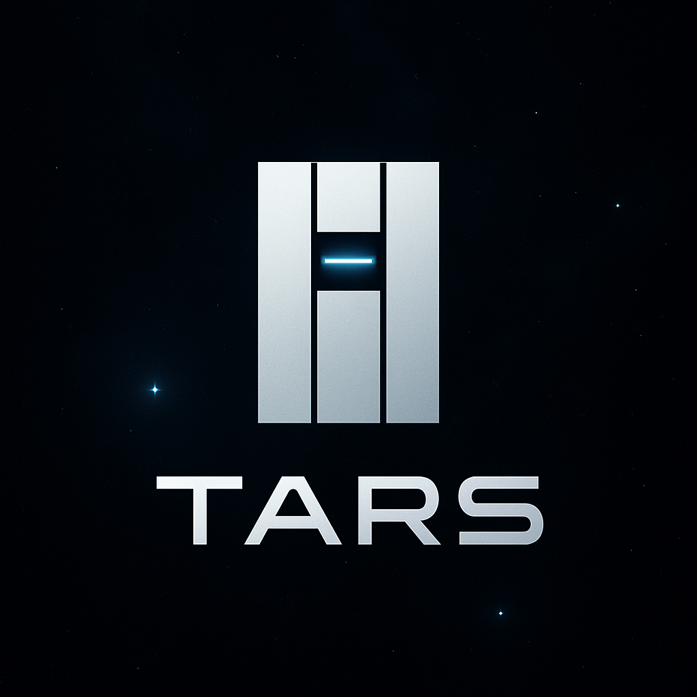

# 🤖 TARS — Interstellar-Inspired Console Bot Assistant



> “TARS is not just a robot. It is a loyal companion who is always there to help.”  
> — *Interstellar*

---

## 🧠 About the project

**TARS** — is a console bot assistant inspired by the robot from the movie **Interstellar**.
Minimalist, convenient and a little ironic — he is always ready to help!

---

## 🔧 Functionality

### 📓 Address book:
- Add, edit, delete contacts
- Search by name or number
- Save and remind about birthdays

### 🗒️ Notes:
- Create notes
- Edit and sort
- Search by keywords

### 🤖 Interaction:
- Greetings, humorous responses
- Intuitive interaction through commands
- Dynamic responses (e.g. `"Phone removed from Alice"`)

---

## ▶️ How it wokrs

- TARS listens to the command → performs the action → responds to the console.
- Keywords: `add`, `edit`, `search`, `edit-note`, `birthdays`, `help`, etc.
- All actions are performed directly in the **terminal**.

---

> **How do future slaves feel, for my robot colony?”**  
> — **TARS**


---

## 💾 Clone

```bash
git clone https://github.com/masiuk-mykola/python-final-project.git
```

```bash
cd python-final-project
```

## 💾 Install

```bash
pip install .
```


## 🚀 Run

```bash
tars
```